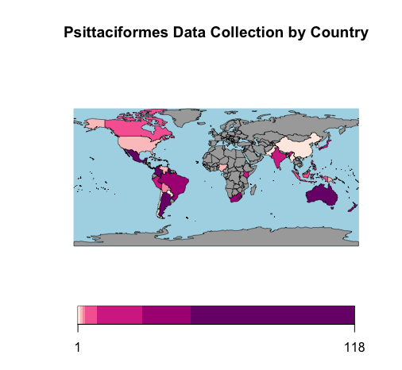

# Psittaciformes investigation

Psittaciformes, more commonly known as parrots, comprise of over 350 species categorized in 84 genera. They are most commonly found in tropical and subtropical regions with the most species richness in Australia, South America and Central America (Heatley & Cornejo, 2015). 

Their bright colours and intelligence have captivated humans for centuries, especially in the Unites States. This has led to large international parrot trade, both legally and illegally. A study conducted at Cornell University explored establishments of parrot species in the USA. Through historical records, as well as data from citizens, it was revealed that 56 different species of parrots were sighted with 25 confirmed breeders (Uehling, Tallant & Pruett-Jones, 2019). 

In this project, the species richness, categorized by unique BIN ID, by country is explored. Despite parrots' dominant prevalence in Australia, South America and Central America, their ability to establish breeding populations in the USA is fascinating. Furthermore, exploring species richness of parrots in countries they are not native to can be important in monitoring how species diversity changes over time as a result of human interference.

